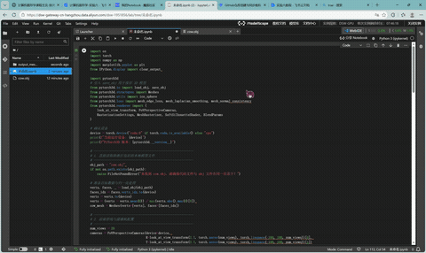

# 实验：基于软光栅化的可微三维网格重建（PyTorch3D）
本项目依托 PyTorch3D 实现可微软光栅化管线，以球体网格为初始模型，通过多视角剪影监督 + 梯度下降优化，将球体逐步形变拟合为奶牛三维网格；引入多重网格正则项规避拓扑崩坏与局部最优，完整掌握可微渲染、梯度平滑、网格约束优化核心图形学知识。
## 学号姓名专业
202411081073
吕铭浩
计算机科学与技术

## 运行效果

## 核心实现逻辑
### 1. 可微软光栅化原理
传统硬光栅化对像素与三角形采用非黑即白的阶跃判定，模型边界处梯度完全消失，无法反向传播更新顶点坐标。
软光栅化通过像素到三角面片边缘距离配合 Sigmoid 函数构造平滑过渡概率分布，在模型轮廓外依旧保留有效梯度，解决梯度消失问题。
σ 参数控制轮廓边缘模糊程度，平滑过渡区间为梯度反向传播提供有效约束。
### 2. 多重网格正则化约束
仅依靠剪影重建损失会造成顶点错乱交叉、网格拉伸畸变，陷入局部最优，因此叠加三类正则损失维持网格几何光滑性：
拉普拉斯平滑约束：约束相邻顶点相对位置，抑制表面尖锐凸起；
边长损失惩罚：限制三角网格边长度剧烈拉伸或收缩；
面法线一致性约束：保证相邻三角面片法线方向相近，维持曲面平滑。
总损失由剪影匹配损失与三类加权正则损失共同构成，平衡重建精度与网格拓扑合理性。
### 3. 实验完整流程
#### 3.1 环境依赖配置
项目依赖 PyTorch、TorchVision 与底层 CUDA 算子库 PyTorch3D；Windows 平台推荐 Conda 安装规避编译报错，Apple Silicon Mac 可直接编译适配版本。
#### 3.2 目标数据预处理
加载奶牛目标三维网格，在三维空间均匀布置多组相机视角，批量渲染生成对应剪影参考图，作为优化监督标签。
#### 3.3 初始模型与可微渲染管线搭建
以高细分球体网格作为待优化初始模型，搭建 PyTorch3D 软剪影光栅化渲染器，支持前向渲染剪影、反向传播梯度至网格顶点。
#### 3.4 梯度下降优化循环
将球体顶点形变偏移量设置为可微训练参数，开启梯度计算；
前向传播渲染当前形变网格的剪影，与目标剪影计算 MSE 重建损失；
叠加拉普拉斯、边长、法线正则惩罚项，构建完整总损失；
采用 Adam/SGD 优化器反向传播更新顶点偏移，迭代优化网格形状。
#### 3.5 迭代可视化输出
训练过程中定时渲染并保存中间结果，直观观察球体逐步形变收敛为奶牛轮廓的完整过程。
## UI 交互说明
实时可视化窗口：查看当前迭代网格剪影与目标剪影对比效果；
定期输出网格模型文件：保存训练中间结果与最终奶牛网格；
关闭窗口 / 终止程序：结束优化迭代。
## 仓库链接
https://github.com/tybxt/zuoye6
